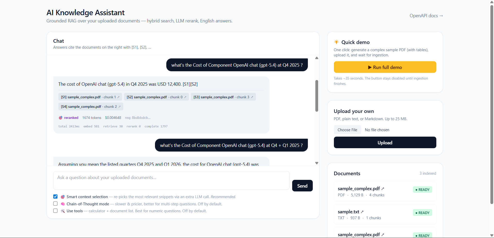
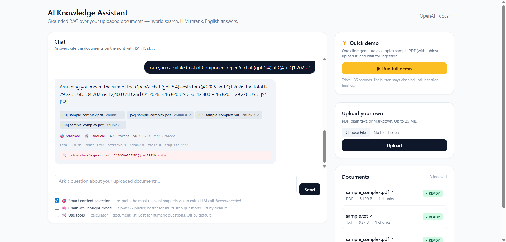

# AI Knowledge Assistant

A production-like RAG-based AI assistant that answers questions grounded **only** in the documents you upload.

- **LLM:** OpenAI `gpt-5.4-2026-03-05` with grounded English-only prompting; **simple prompt by default** (~$0.005/query) with an opt-in **Chain-of-Thought toggle** for complex multi-hop questions (~$0.009/query)
- **Embeddings:** OpenAI `text-embedding-3-large` (3072 dim)
- **Retrieval:** Hybrid — vector (FAISS) + BM25 (rank-bm25) fused via Reciprocal Rank Fusion, then LLM listwise reranked
- **Vector store:** FAISS (local, file-backed, zero-service)
- **Metadata store:** PostgreSQL (via SQLAlchemy async + Alembic)
- **Cache:** Redis (response + embedding caches)
- **Concurrency:** async read-write lock over FAISS so `/ask` calls run in parallel (~3.7× speedup measured on 5 cold concurrent requests)
- **API:** FastAPI
- **Web UI:** Server-rendered Jinja2 + HTMX + Tailwind (CDN). No npm, no separate dev server, no build step — the FE lives in the same FastAPI process at `http://localhost:8000/`

## Screenshots

**Standard chat — citations, toggles, and the document panel.**



The bubble footer shows live token count, cost (USD, 6 d.p.), request id, and a per-stage latency breakdown. Citation pills hover to reveal the snippet and click to open the source PDF in a new tab.

**Tool calling — same question with 🛠️ Use tools enabled.**



The LLM decides to call the calculator (`calculate({"expression": "(17940-13335)/13335*100"}) → 34.5332`) and uses the precise result in its answer. The invocation is visible in the bubble footer with timing and ok/error status.

## Prerequisites

- **Docker Desktop** (the only requirement for the recommended path)
- An **OpenAI API key**

That's it. Python, `uv`, and Postgres are all containerized — you don't install them on the host.

## Quick start — one command (recommended)

```bash
# 1. Drop your OpenAI key into the env file
cp .env.example .env
#    then edit .env and replace OPENAI_API_KEY=sk-replace-me with your key

# 2. Build & start everything (Postgres + Redis + API)
docker compose up
```

That's it. **Open http://localhost:8000/** and you'll see the chat UI. OpenAPI docs live at **http://localhost:8000/docs**.

What `docker compose up` does on first run:
- Pulls Postgres 16 + Redis 7
- Builds the API image (~3-4 min on first build, cached afterwards)
- Waits for Postgres + Redis healthchecks
- Runs `alembic upgrade head` automatically
- Starts uvicorn on port 8000

Subsequent runs just start the existing containers in seconds. Add `-d` to run in the background. To stop: `docker compose down`. To wipe state and start over: `docker compose down -v` (removes the Postgres + Redis volumes; `data/` on the host is preserved).

> **Tip:** the app eagerly embeds the intent-classifier anchors on startup. The first boot makes one OpenAI request (~1 s). The result is cached in Redis so subsequent boots are instant.

## Quick start — local development (with `uv`)

If you want hot-reload while editing Python code, run the API on the host with `uv` and only Postgres + Redis in Docker:

### Install `uv`

[`uv`](https://github.com/astral-sh/uv) is the Python package manager used by this project. It manages the virtualenv and dependencies — no `pip install` needed.

```bash
# Windows (PowerShell)
powershell -ExecutionPolicy ByPass -c "irm https://astral.sh/uv/install.ps1 | iex"

# macOS / Linux
curl -LsSf https://astral.sh/uv/install.sh | sh

# verify
uv --version    # 0.10.x or newer
```

### Run

```bash
uv sync                                       # install deps into .venv
cp .env.example .env                          # set OPENAI_API_KEY
docker compose up -d postgres redis           # only the data services
uv run alembic upgrade head                   # apply migrations
uv run uvicorn app.main:app --reload          # run with hot-reload
```

API is live at http://localhost:8000. OpenAPI docs at http://localhost:8000/docs.

## Endpoints

| Method | Path | Purpose |
|---|---|---|
| `GET` | `/health` | Liveness |
| `GET` | `/health/ready` | Readiness (DB + Redis check) |
| `POST` | `/api/v1/documents` | Upload a PDF / TXT / MD document |
| `GET` | `/api/v1/documents` | List documents (paginated) |
| `GET` | `/api/v1/documents/{id}` | Get one document |
| `PATCH` | `/api/v1/documents/{id}` | Rename a document |
| `DELETE` | `/api/v1/documents/{id}` | Delete a document + its vectors |
| `POST` | `/api/v1/ask` | Ask a grounded question |

## Sample usage

### Upload

```bash
curl -X POST http://localhost:8000/api/v1/documents \
  -F "file=@ASSIGNMENT.md"
```

Response:
```json
{
  "id": "c1a7b2e0-...",
  "filename": "ASSIGNMENT.md",
  "file_type": "md",
  "status": "READY",
  "chunk_count": 12,
  "size_bytes": 3675,
  "content_hash": "...",
  "created_at": "...",
  "updated_at": "..."
}
```

### Ask

```bash
curl -X POST http://localhost:8000/api/v1/ask \
  -H "Content-Type: application/json" \
  -d '{"question": "What is the objective of the assignment?"}'
```

Response:
```json
{
  "answer": "The objective is to build a production-like AI assistant... [S1]",
  "is_grounded": true,
  "refusal_reason": null,
  "citations": [
    {
      "chunk_id": "...:0",
      "document_id": "...",
      "filename": "ASSIGNMENT.md",
      "chunk_index": 0,
      "score": 0.78,
      "snippet": "..."
    }
  ],
  "usage": {
    "prompt_tokens": 1024,
    "completion_tokens": 87,
    "total_tokens": 1111,
    "estimated_cost_usd": "0.003866",
    "model": "gpt-5.4-2026-03-05",
    "cache_hit": false
  },
  "request_id": "..."
}
```

Scope the question to specific documents:
```bash
curl -X POST http://localhost:8000/api/v1/ask \
  -H "Content-Type: application/json" \
  -d '{
    "question": "What file types are accepted?",
    "document_ids": ["c1a7b2e0-..."]
  }'
```

## Intent handling — greetings, farewells, off-topic

Not every message is a RAG query. The assistant classifies each incoming question into one of four intents and routes accordingly:

| Intent | Routed to | Cost | `model` field | `is_grounded` | `refusal_reason` |
|---|---|---|---|---|---|
| Greeting (`"halo"`, `"hi there"`, `"ciao"`) | Static reply | $0 | `static` | `true` | `null` |
| Farewell (`"thanks bye"`, `"grazie"`) | Static reply | $0 | `static` | `true` | `null` |
| Off-topic (no relevant chunks found) | Soft refusal | $0 | `static` | `false` | `off_topic` |
| RAG query | Full hybrid + rerank + LLM pipeline | ~$0.007–0.018 | `gpt-5.4-2026-03-05` | true / false | `null` or `no_relevant_context_in_corpus` |

**Greeting/farewell classification** uses a **two-layer pipeline**:

| Layer | What | Latency | When it triggers |
|---|---|---|---|
| **1. Fast-path** | `frozenset` literal lookup over ~25 common phrases (`"halo"`, `"hi"`, `"thanks bye"`, `"grazie"`, …). Input is normalized: lowercased, trailing punctuation stripped, **runs of 3+ identical letters collapsed to one** (`holaaaaa` → `hola`, `byeeee` → `bye`) | **<1 ms, zero network** | Exact normalized match — also catches casual elongations |
| **2. Embedding classifier** | Cosine similarity to ~10 anchor phrases per class, multilingual (Italian, Spanish, French, Hindi, Japanese, German) | <1 ms after embed (one OpenAI call) | Anything not in the fast-path set |

Layer 1 is a **memoization cache**, not a classifier — anything not in the set still falls through to Layer 2's flexible embedding match, so multilingual coverage and paraphrase tolerance are preserved.

Anchors are embedded once on app startup (eager `warm()` from FastAPI's `lifespan`) and persisted to Redis via the existing embedding cache — subsequent restarts skip OpenAI entirely.

We picked this two-layer setup over a small LLM router for four reasons:

1. **Latency** — fast-path is <1 ms (no network). Embedding fallback is <1 ms after embed. An LLM router adds 200–800 ms (or more on slow networks) to every `/ask`, including cache hits.
2. **Cost** — both layers are $0/query at runtime; an LLM router pays a routing fee on 100% of queries to filter out the ~5% that are non-RAG.
3. **Reliability** — fast-path is in-process; embedding-anchor cosine is local NumPy. An LLM router is a hard dependency on the chat path.
4. **Off-topic isn't a pre-retrieval problem** — you can't classify a question as off-topic without seeing the corpus. We handle that *after* retrieval (no chunks above the relevance floor → soft refusal).

**Measured live:**
- `"halo"`: **8 s → 0.21 s** (38× faster, fast-path hit)
- `"holaaaaaaaaaaa"`: **8 s → 0.21 s** (collapse rule maps to `hola`, fast-path hit)
- `"hellooooo"`, `"thxxxxx"`, `"byeeeee"`: all **<0.25 s**

See [docs/architecture.md §14](docs/architecture.md) for the full design rationale and verified-live results.

## Three UI toggles for accuracy / cost / latency

All three toggles live under the chat input. Each maps to a request flag and a column in the cache key, so toggling never returns a stale answer from another mode:

| Toggle | Request field | Default | What it does | Cost / latency hit |
|---|---|---|---|---|
| **🎯 Smart context selection** | `enable_rerank` | **on** | Runs an extra LLM call to re-rank retrieved snippets and pick the most relevant ones | +1 LLM call; ~$0.002–0.005/query |
| **🧠 Chain-of-Thought mode** | `enable_cot` | off | Reasons step-by-step inside `<thinking>` tags; FE strips reasoning before render | ~5× output tokens (~$0.003 extra/query); +1–3 s of generation |
| **🛠️ Use tools** | `enable_tools` | off | Lets the LLM call tools (calculator, list_documents) when it judges them helpful. MCP-shaped registry; one file per tool | +1 LLM call per tool round (~$0.005 extra); precise math, no LLM arithmetic errors |

API control:
```bash
curl -X POST http://localhost:8000/api/v1/ask \
  -H "Content-Type: application/json" \
  -d '{
    "question": "By exactly what percent did total cost rise from Q4 2025 to Q1 2026?",
    "enable_rerank": true,
    "enable_cot": false,
    "enable_tools": true
  }'
```

Server defaults come from `.env`. Per-request `enable_rerank: null` falls back to the server setting; `enable_cot` and `enable_tools` default to `false`.

The cache key is `system:{simple|cot}/user:{simple|cot}/rerank:{0|1}/tools:{0|1}` — eight mutually-isolated cache buckets, each invalidated independently when its prompt version is bumped.

### Tool calling — the 🛠️ toggle in detail

When **🛠️ Use tools** is on, the LLM receives the registered tools and may emit `tool_calls` instead of (or before) the final answer. The pipeline executes each call, returns the result as a `role="tool"` message, and re-invokes the LLM. The loop terminates when the LLM returns a normal answer or hits `MAX_TOOL_ITERATIONS=4`.

Two tools ship out of the box:

| Tool | Purpose | Args (Pydantic-validated) |
|---|---|---|
| `calculate` | Evaluate arithmetic safely (AST-walked, rejects function calls, attribute access, names — no `eval()`). Use for percentages, totals, ratios. | `expression: str` |
| `list_documents` | Return the indexed corpus (filename, type, size, chunk count, status). For meta-questions like "what docs do I have?" | `limit: int` |

**Adding a new tool** is a single file in `app/tools/`: define a Pydantic args model, write an `async def handler(...) -> str`, and register a `Tool` in `tools/__init__.py:build_default_registry()`. Schema is validated at registration; bad schemas fail fast at app startup.

**Live-measured** on "By exactly what percent did total cost rise from Q4 2025 to Q1 2026?":

| | tools=OFF | tools=ON |
|---|---|---|
| Answer precision | "≈ 34.5%" (LLM mental math) | "exactly **34.5332%**" (from calculator) |
| Tool calls | 0 | 1 — `calculate("(17940-13335)/13335*100") → 34.5332` in 0.2 ms |
| Cost / query | $0.0058 | $0.0124 |

The bubble footer shows a 🛠️ pill when tools were used, plus a small monospace block listing each invocation: name, arguments, output (truncated to `MAX_TOOL_OUTPUT_CHARS`), success/error flag, and elapsed time.

**Failure handling** (CLAUDE.md rule 10):

- Unknown tool name → `ToolCallResult(ok=False, error="ToolNotFound")` — the LLM sees the error string and can self-correct or refuse.
- Tool args fail Pydantic validation → `ok=False, error="ValidationError"`.
- Tool handler raises → `ok=False, error="<ExceptionName>"`. Never breaks the request.
- Loop exceeds `MAX_TOOL_ITERATIONS` → `ToolLoopExceeded` → HTTP 502.

### Per-stage timing in every response

Every `/ask` response includes a `usage.timings` object so you can see where time is going:

```json
"timings": {
  "embed_ms": 8690.0,
  "retrieve_ms": 8689.0,
  "rerank_ms": 0.0,
  "complete_ms": 5380.0,
  "total_ms": 27150.0
}
```

The chat UI shows these in a small monospace footer line under each bubble. Useful for telling at a glance *where* the latency is — e.g. complete=5400ms means the LLM is slow, embed=8000ms means the network to OpenAI is slow.

## Prompt modes — Simple (default) vs Chain-of-Thought (opt-in)

The `/ask` endpoint runs in **simple mode** by default — minimal grounding rules, refusal sentence, English-only output. Set `enable_cot: true` (or check the **🧠 Chain-of-Thought mode** box in the UI) to switch to a structured CoT prompt with explicit reasoning steps.

Both modes share the same retrieval, reranking, and citation rules. They differ only in the system + user prompt the LLM sees.

| | Simple (default) | CoT (opt-in) |
|---|---|---|
| Prompt version | `simple-v4` | `cot-v3` |
| Output format | Direct answer + citations | `<thinking>` block + `<answer>` block; FE strips reasoning |
| Completion tokens (measured) | ~30–50 | ~200–300 |
| Cost / RAG query (measured) | **~$0.005** | **~$0.009** |
| Best for | Single-fact lookups, definitions, short facts from one chunk | Multi-hop reasoning, comparing chunks, cross-checking facts |

**Cache key includes the prompt version**, so toggling the flag never returns a stale answer from the other mode.

```bash
# Default (simple)
curl -X POST http://localhost:8000/api/v1/ask \
  -H "Content-Type: application/json" \
  -d '{"question": "What was the p95 latency in Q1 2026?"}'

# Opt-in to CoT
curl -X POST http://localhost:8000/api/v1/ask \
  -H "Content-Type: application/json" \
  -d '{"question": "Why did Q1 2026 cost rise vs Q4 2025, and which line items drove it most?", "enable_cot": true}'
```

The chat UI footer shows a **🧠 CoT** badge on bubbles produced in CoT mode so you can see at a glance which prompt produced each answer.

## Behaviour when context is missing

If no chunk in the corpus passes the relevance floor, the request returns **HTTP 200** with a soft refusal:
```json
{
  "answer": "I don't have anything in your uploaded documents about that. Try uploading a relevant document, or ask a question that's covered by your existing corpus.",
  "is_grounded": false,
  "refusal_reason": "off_topic",
  "citations": [],
  "usage": { "model": "static", "estimated_cost_usd": "0", ... }
}
```

If the corpus does contain relevant chunks but the LLM still refuses (Step-4 self-check failed), the response is:
```json
{
  "answer": "I do not have enough information in the provided documents to answer that.",
  "is_grounded": false,
  "refusal_reason": "no_relevant_context_in_corpus",
  ...
}
```

`POST /api/v1/ask` returns **HTTP 400** for empty queries via `EmptyQuery`.

## Architecture overview

```
HTTP route  →  service  →  pipeline  →  retriever / LLM client / vector store
                             ↓
                      domain models + prompts
```

Strict layered design (see [docs/architecture.md](docs/architecture.md) for full diagrams):

- **Interface** (`api/`): FastAPI routes per `/api/v1`, plus `application/` for health.
- **Application** (`services/`, `pipelines/`): orchestration only. `query_pipeline` wires hybrid retrieval → reranker → CoT LLM call → response parser.
- **Domain** (`models/domain/`, `prompts/`): plain dataclasses + versioned prompt files. No SDK imports.
- **Infrastructure** (`storages/`, `llm_clients/`, `embedders/`, `loaders/`, `chunkers/`): every external system (OpenAI, FAISS, Postgres, Redis, pypdf) is behind a thin wrapper. Business logic never imports the SDK directly — vendor swap = one new file.
- **Wiring** (`dependencies.py`): single composition root. Tests inject fakes via `Container`.

## Design decisions and trade-offs

| Decision | Why | Trade-off |
|---|---|---|
| **FAISS** (in-process) over Pinecone/Qdrant | Zero extra service, ~50 MB pip install, instant startup for evaluators | Single-process; multi-worker deploys need a vector DB swap |
| **Hybrid search (BM25 + vector) + RRF fusion** | Catches keyword misses (rare proper nouns) AND paraphrases that BM25 alone would miss | +2-5 ms per query; BM25 index rebuild on every corpus change |
| **LLM listwise reranker** (opt-in via `RERANK_ENABLED`) | One extra LLM call reorders top-N → top-K, big lift on ambiguous queries | +$0.002–0.005/query; gracefully degrades to fused order on parse failure |
| **Chain-of-Thought v3 with `<thinking>`/`<answer>` tags** | Forces a 4-step self-check that strips unsupported claims before emit; reasoning logged but never returned to client | +200–400 completion tokens vs free-form |
| **English-only answers** | Consistent UX even with multi-language corpora (e.g. tested live on an Italian PDF) | If users want native-language answers, prompt rule 7 must be relaxed |
| **OpenAI `text-embedding-3-large`** (3072 dim) | Best-quality OpenAI embeddings; supports cross-lingual retrieval out of the box | More vector storage; FAISS `IndexFlatIP` is exact (no ANN approx errors at our scale) |
| **Two-level cache** (response + embedding) | Response cache eliminates LLM cost on repeats; embedding cache means re-uploads cost $0 in embeddings | Response cache invalidates on prompt-version bump (correct behaviour) |
| **Async RWLock over FAISS** | Concurrent `/ask` calls run in parallel — measured 3.72× speedup for 5 cold requests | Slightly more complex than a plain `asyncio.Lock` |
| **Schema / domain / ORM separation** | API contract changes don't touch persistence; tests work without a DB | More mappers to maintain |
| **Alembic autogenerate + manual review** | Standard tooling, but every migration is reviewed before apply (server defaults, `pgcrypto` extension, indexes) per CLAUDE.md rule 13 | Discipline-only — easy to skip the review step under pressure |
| **`uv` package manager** | Fast, reproducible installs; one tool replaces pip / venv / pip-tools | Less ubiquitous than pip — but trivially installable |
| **`ftfy` mojibake fix on text/PDF extraction** | Some PDFs return UTF-8 bytes decoded as Latin-1; ftfy restores smart quotes and accents losslessly | +1 dep; no-op on already-clean text |
| **Hybrid PDF loader (pypdf + pdfplumber)** | pypdf gets prose; pdfplumber detects tables and emits them as Markdown tables that gpt-5.4 reads natively. Verified live with multi-table reports — exact cell-level Q&A | +30 MB dep; pdfplumber ~100-300 ms/page on table-heavy PDFs. No OCR for scanned PDFs (documented upgrade path) |

## How we handled key concerns

### Hallucinations
Three independent defences, layered:

1. **Grounded-only system prompt** (`prompts/system_prompt.py`, version `v3`): instructs the model to use ONLY the provided CONTEXT, refuse with an exact sentence when context is insufficient, and never use prior knowledge.
2. **Chain-of-Thought self-check**: the prompt requires Step 4 of `<thinking>` to verify every drafted claim is supported by a `[Sn]` snippet — unsupported claims are removed before emit.
3. **Pre-LLM relevance floor** (`MIN_RELEVANCE_SCORE`): if no retrieved chunk passes the floor, we raise `NoRelevantContext` (HTTP 404) before ever calling the LLM. The reranker can also empty the candidate set, which produces the same refusal.
4. **Refusal detection in code** (`is_refusal`): if the model emits the refusal sentence, `is_grounded=false` and citations are stripped — clients can branch on a typed flag, not string parsing.

Defensive parser (`parse_response`) handles malformed structured output (missing `<answer>` tag, nested tags, plain prose) without ever raising — strips residual `<answer>`/`<thinking>` substrings if the model nests them.

### Cost optimization
LLM input/output dominates (~95% of per-query cost). Levers, ordered by impact:

1. **Response cache** keyed by `sha256(normalized_query + sorted_doc_ids + model + prompt_version)`. Refusals are NOT cached. Bumping the prompt version invalidates automatically.
2. **Embedding cache** keyed by `sha256(chunk_text) + model`. 30-day TTL. Re-uploading the same document costs $0 in embeddings.
3. **Token-budget guard**: `fits_in_budget()` runs before every LLM call. Hard cap (`MAX_CONTEXT_TOKENS=8000`) keeps prompts well below the gpt-5.4 272K extended-context boundary, where input rates double.
4. **Retrieved-chunk trimming**: chunks below `MIN_RELEVANCE_SCORE` are dropped; remaining chunks are truncated to fit the budget by lowest score.
5. **Authoritative cost metrics**: `estimated_cost_usd` uses the API's `usage.prompt_tokens` / `usage.completion_tokens` (truth), not our local `tiktoken` estimate (which drifts ±5 tokens). Local estimate is only used for the pre-send budget check.
6. **Optional reranker** (`RERANK_ENABLED`): adds ~$0.003/query for accuracy; deployments that don't need it can disable.

Concrete numbers per `/ask`: ~$0.007–0.018 cold (CoT raises completion tokens), ~$0 cached.

### Failures
Errors are typed at the layer that raises and translated at each boundary (CLAUDE.md rule 10).

| Failure | Where caught | What happens |
|---|---|---|
| Empty / oversized query | `validators/query_validator.py` | `EmptyQuery`/`QueryTooLong` → HTTP 400 |
| Unsupported file type / oversized upload | `validators/upload_validator.py` | `UnsupportedFileType`→ 415, `UploadTooLarge` → 413 |
| Document not found | `repositories/document_repository.py` | `DocumentNotFound` → HTTP 404 |
| No retrieved chunks above floor | `pipelines/query_pipeline.py` | `NoRelevantContext` → HTTP 404, never calls LLM |
| LLM timeout | `llm_clients/openai_chat_client.py` | retried (`tenacity` exponential backoff); raises `LLMTimeoutError` → HTTP 504 |
| LLM rate limit | same | retried, then `LLMRateLimitError` → HTTP 429 |
| Content-filter block | same | `LLMContentFilterError` → HTTP 422 |
| Malformed LLM JSON (rerank) | `retrievers/reranker.py` | logs warning, falls back to fused ordering — request still succeeds |
| OpenAI parse failure of `<answer>` tags | `prompts/answer_with_context.py` | parser falls back to whole-response-as-answer — request still succeeds |
| FAISS / Redis / Postgres error | infra layer | typed `*Error` → 502/500 with structured log; vendor traceback never leaves the process |
| Ingestion failure (PDF parse, embed, upsert) | `services/document_service.py` | document marked `FAILED` with `error_message`; DB stays consistent with vector store |
| `DELETE /documents/{id}` mid-crash | `services/document_service.py` | vectors deleted before DB row → orphan vectors are recoverable, orphan DB rows are not |

No bare `except:` anywhere. Infra errors never leak vendor tracebacks to clients.

## Demo instructions

### How to run locally

1. **Install `uv`** (see "Install `uv`" section above) and start Docker Desktop.
2. **One-time setup**:
   ```bash
   uv sync
   cp .env.example .env
   # edit .env and set OPENAI_API_KEY
   docker compose up -d
   uv run alembic upgrade head
   ```
3. **Run the API**:
   ```bash
   uv run uvicorn app.main:app --reload
   ```
   - **Web UI** on http://localhost:8000/ — chat + upload + demo button
   - **OpenAPI docs** on http://localhost:8000/docs
   - All API routes mounted at `/api/v1/...`

4. **(Optional) Run the test suite**:
   ```bash
   uv run pytest tests/unit -q
   # 138 passed
   ```

### Web UI walkthrough

Open **http://localhost:8000/** for the built-in chat interface (no npm, no build step — Jinja2 + HTMX + Tailwind CDN inside the same FastAPI process).

Two ways to load documents:

**Option A — Quick demo (one click).** The amber **▶ Run full demo** button generates a complex sample PDF (3 tables: SLA metrics, cost breakdown, incidents — see `app/utils/sample_pdf.py`), uploads it, runs ingestion, and shows it as `READY` in the documents panel. Takes ~35 s. Try asking:

- "What was the p95 latency in Q1 2026 and what is the SLA target?"
- "List the four production incidents with severity and root cause."
- "How much did OpenAI chat cost in Q1 2026 and what was the percentage change vs Q4 2025?"

**Option B — Manual.** Use the **Upload your own** form to upload any PDF/TXT/MD. The document list polls in real time; you can ask the moment status flips to `READY`.

The chat bubbles show:
- The grounded answer in English (regardless of source language)
- One citation pill per `[Sn]` — hovering reveals the source snippet
- Token count, cost, and a `req: ...` request-id for log correlation
- A `⚠ Not grounded` badge when the LLM refuses, and a `✓ cache hit` badge when the response cache served the answer

### Sample queries via curl

The samples below assume you've uploaded `data/corpus/sample.txt` (shipped with the repo) and a PDF of your own. Substitute the document ID after upload.

**1. Upload a text file**
```bash
curl -X POST http://localhost:8000/api/v1/documents \
  -F "file=@data/corpus/sample.txt"
```

**2. Upload a PDF (multi-language supported)**
```bash
curl -X POST http://localhost:8000/api/v1/documents \
  -F "file=@/path/to/your.pdf"
```

**2a. Generate and upload a complex PDF with tables** (to demo the hybrid loader)
```bash
uv run python scripts/generate_test_pdf.py
curl -X POST http://localhost:8000/api/v1/documents \
  -F "file=@data/corpus/sample_complex.pdf"
# Then ask a table-targeted question:
curl -X POST http://localhost:8000/api/v1/ask \
  -H "Content-Type: application/json" \
  -d '{"question": "What was the p95 latency in Q1 2026 and what is the SLA target?"}'
# Expected: "3100 ms, SLA target ≤ 5000 ms" — pulled directly from the SLA table.
```

**3. Ask a grounded question**
```bash
curl -X POST http://localhost:8000/api/v1/ask \
  -H "Content-Type: application/json" \
  -d '{"question": "What is the SLA for /ask requests?"}'
```
Expected: `is_grounded: true`, English answer with `[S1]` citation, `cache_hit: false`.

**4. Ask the same question again — cache hit**
```bash
curl -X POST http://localhost:8000/api/v1/ask \
  -H "Content-Type: application/json" \
  -d '{"question": "What is the SLA for /ask requests?"}'
```
Expected: `cache_hit: true`, latency ~150 ms, `estimated_cost_usd: $0` from OpenAI's perspective.

**5. Ask an out-of-corpus question — soft refusal**
```bash
curl -X POST http://localhost:8000/api/v1/ask \
  -H "Content-Type: application/json" \
  -d '{"question": "What is the capital of Argentina?"}'
```
Expected: HTTP 200, `is_grounded: false`, `refusal_reason: "off_topic"` (or `no_relevant_context_in_corpus` if retrieval found marginal chunks but the LLM refused), `model: "static"` or `gpt-5.4-...`.

**5a. Greeting — static response, no LLM call**
```bash
curl -X POST http://localhost:8000/api/v1/ask \
  -H "Content-Type: application/json" \
  -d '{"question": "halo"}'
```
Expected: HTTP 200, `model: "static"`, `estimated_cost_usd: "0"`, friendly greeting body.

**5b. Farewell — static response, multilingual**
```bash
curl -X POST http://localhost:8000/api/v1/ask \
  -H "Content-Type: application/json" \
  -d '{"question": "grazie ciao"}'
```
Expected: HTTP 200, `model: "static"`, `cost: 0`, farewell body — works across English, Italian, Spanish, French, Hindi, Japanese, German.

**6. Empty query — validation rejects**
```bash
curl -X POST http://localhost:8000/api/v1/ask \
  -H "Content-Type: application/json" \
  -d '{"question": "   "}'
```
Expected: HTTP 400 `EmptyQuery`.

**7. Scoped question — only this document**
```bash
curl -X POST http://localhost:8000/api/v1/ask \
  -H "Content-Type: application/json" \
  -d '{
    "question": "Summarise the main themes.",
    "document_ids": ["<paste-document-id>"]
  }'
```

**8. Ask in English about a non-English PDF** (English answer is enforced)
```bash
curl -X POST http://localhost:8000/api/v1/ask \
  -H "Content-Type: application/json" \
  -d '{"question": "What does this document say?"}'
```

**9. Concurrency benchmark** — 5 different questions in parallel:
```bash
uv run python scripts/concurrency_smoke.py
```
Expected: ~3.7× speedup on cold runs vs serial; ~0.3s wall-clock when cached.

**10. Document CRUD**
```bash
curl http://localhost:8000/api/v1/documents                    # list
curl http://localhost:8000/api/v1/documents/<id>               # get
curl -X PATCH http://localhost:8000/api/v1/documents/<id> \
  -H "Content-Type: application/json" \
  -d '{"filename": "renamed.pdf"}'                              # rename
curl -X DELETE http://localhost:8000/api/v1/documents/<id>     # delete (also drops vectors)
```

## Future improvements

Each item below addresses a known limitation. The list is grouped by theme and ordered by ROI within each group. The wrappers in `loaders/`, `storages/`, `llm_clients/`, and `retrievers/` mean every upgrade is a localized change — no business-logic refactor required.

### PDF / ingestion quality

| # | Problem today | Proposed upgrade | Trade-off |
|---|---|---|---|
| 1 | Scanned / image-only PDFs return empty text and ingest as 0 chunks. | OCR fallback in `loaders/pdf_loader.py`: if pypdf returns < N chars, route the page to **Tesseract** (`pytesseract` + system Tesseract binary) or a cloud OCR (AWS Textract, Azure Document Intelligence). Gate behind `UPLOAD_ENABLE_OCR` flag. | Tesseract free but slow (~2-3 s/page); cloud OCR is faster + better on tables-in-scans but $1.50–$15 / 1000 pages. |
| 2 | Charts, diagrams, and embedded images are invisible to the assistant. | **Vision-LLM page rendering**: convert each page to an image and call gpt-5.4 (vision) with "extract this page as Markdown, preserving table structure and describing any charts." Use as a per-page enrichment, not a replacement. | ~$0.005–$0.02/page; only worth it for visual corpora. |
| 3 | Multi-column layouts (newspapers, two-column papers) interleave columns. | Switch the prose pass from pypdf to **PyMuPDF (`fitz`)** which has layout-aware reading order. Or upgrade to **`unstructured.io`** which handles weird layouts at the cost of ~500 MB of dependencies. | PyMuPDF is AGPL — fine for take-home and internal use, can be a blocker in proprietary product packaging. |
| 4 | Headers, footers, and page numbers pollute chunks. | Detect repeated short lines across pages (heuristic) or use unstructured.io's element classifier. Drop them before chunking. | Heuristic is fragile on unusual layouts; classifier is more reliable but heavier. |
| 5 | AcroForm field values often missing. | `pypdf.PdfReader.get_fields()` extracts form fields; merge them into the per-page text. | Tiny code change; handles a niche but real document type. |

### Retrieval quality

| # | Problem today | Proposed upgrade | Trade-off |
|---|---|---|---|
| 6 | BM25 tokenizer is a regex-based ASCII splitter — no stemming, no language-aware analysis. Italian/German/Japanese suffer. | Replace `_tokenize` with a per-language analyzer (`Snowball` for stemming, `Jieba` for Chinese, `Sudachi` for Japanese). Detect language with `langdetect` per chunk. | A few new deps; small accuracy lift on multilingual corpora; minor overhead at index build time. |
| 7 | LLM listwise reranker uses `gpt-5.4` — accurate but expensive (~$0.003/query). | Swap to a cheaper model (Haiku, `gpt-5.4-mini` if/when available) for reranking only. Or use a **cross-encoder** (`bge-reranker-v2-m3`, runs locally) — single 30 ms inference vs ~1-2 s LLM call. | Cross-encoder needs ~600 MB model download and a CPU/GPU; quality is comparable for most queries. |
| 8 | No query rewriting — sparse or ambiguous questions retrieve poorly. | Add a `query_rewriter` LLM step before retrieval: rewrite the question into 2-3 well-formed search queries, run hybrid retrieval per rewrite, fuse via RRF. | One extra cheap LLM call per query (~$0.001); +200 ms latency; meaningful accuracy lift on conversational queries. |
| 9 | No HyDE (Hypothetical Document Embeddings). | LLM generates a hypothetical answer first, embed THAT, retrieve nearest neighbors. Often beats raw query embedding for short queries. | One extra LLM call; orthogonal to query rewriting — pick whichever the eval set says is better. |
| 10 | BM25 index is rebuilt from scratch on every corpus change. | Switch to a persistent inverted index (`tantivy`-py or `lucene`-via-pyserini). | Real index build is incremental; +1 dep with native bindings. |

### Scale & operations

| # | Problem today | Proposed upgrade | Trade-off |
|---|---|---|---|
| 11 | FAISS state is in-process — multi-worker uvicorn = N divergent indexes. | Swap `faiss_store.py` to a **Qdrant** wrapper. Same wrapper interface; no business-logic changes. | Adds a Docker container; gains real concurrency, persistence, and clustering. |
| 12 | `IndexFlatIP` is exact (good quality) but linear-scan; degrades past ~1M vectors. | Switch to **HNSW** (`IndexHNSWFlat`) once corpus crosses ~500K chunks. | Approximate (typical ~99% recall@10); needs an `efSearch` knob in config. |
| 13 | No tracing or Prometheus metrics endpoint. | Wire **OpenTelemetry** in `core/metrics.py`; expose `/metrics` for Prometheus. | Standard ops upgrade; one new dep. |
| 14 | No rate limiting or auth. | `slowapi` for per-IP / per-tenant rate limits; FastAPI `Depends` for API-key auth. | Standard; 30 minutes of work. |
| 15 | Ingestion is synchronous on `POST /documents` — large PDFs block the request for tens of seconds. | Background ingestion via `FastAPI.BackgroundTasks` (small) or a proper queue (`ARQ`/`Celery`) for long-running jobs. Status visible via `GET /documents/{id}`. | Changes the API contract — clients must poll. Currently kept synchronous because the corpus is small. |

### LLM, safety, and quality

| # | Problem today | Proposed upgrade | Trade-off |
|---|---|---|---|
| 16 | No streaming — clients see a 2-5 s pause then a wall of text. | Add `POST /api/v1/ask:stream` returning Server-Sent Events of the `<answer>` token-by-token. CoT `<thinking>` block is buffered server-side. | Adds an SSE codepath; thinking-tag handling needs care so clients never see reasoning. |
| 17 | No tool calling (assignment bonus). | Add a `tools/` registry (calculator, search) and use OpenAI's tool-call API. Each tool implementation becomes a one-file plugin. | Architecture already supports it (`agents/` and `tools/` are listed in CLAUDE.md's chatbot template). |
| 18 | No safety classifier on inputs — jailbreak attempts go straight to the LLM. | Add a lightweight prompt-injection detector (regex + small classifier) in `validators/query_validator.py`. | Fast; low risk of false positives. |
| 19 | No structured-output validation. | When clients want JSON answers, define a Pydantic schema and use OpenAI's `response_format={"type": "json_schema", ...}`. Validate before returning. | Useful for downstream agent/tool integration. |
| 20 | No conversation/session memory — each `/ask` is independent. | Add a `sessions/` table + memory summarization (last N turns + rolling summary) injected into the user prompt. | Significant — turns the assistant into a chatbot rather than a Q&A endpoint. |

### Evaluation & cost discipline

| # | Problem today | Proposed upgrade | Trade-off |
|---|---|---|---|
| 21 | Golden-set evaluation is manual. | CI job (`make eval`) runs `tests/eval/golden_set.yaml` on every PR; surfaces accuracy delta + cost delta vs the baseline branch. | Standard practice; needs a small eval harness in `evaluators/`. |
| 22 | Embeddings always use the sync API. | One-time corpus reindex jobs go through OpenAI's **Batch API** (50% cheaper, 24-hour SLA acceptable for ingestion). | One extra code path in `openai_embedder.py`; meaningful savings on large corpora. |
| 23 | No A/B framework for prompt versions. | Hash user/request to bucket → route to `SYSTEM_PROMPT_V3` vs `SYSTEM_PROMPT_V4` → log per-bucket metrics. | Clean way to ship prompt changes safely. |
| 24 | No drift detection on retrieval quality. | Schedule a daily golden-set run, page if the pass rate drops below a baseline. | Catches model regressions, prompt drift, and silent corpus issues early. |

### Priority order if I had another day

1. **OCR fallback** (#1) — the single most common "PDF ingested but answers nothing" complaint.
2. **Cross-encoder reranker** (#7) — biggest accuracy lift for the lowest ongoing cost.
3. **Background ingestion + status polling** (#15) — needed before ingesting any real-world corpus with multi-megabyte PDFs.
4. **OpenTelemetry tracing** (#13) — turns "the API feels slow" into a flame graph.
5. **Streaming responses** (#16) — biggest perceived UX upgrade.

## Project layout

```
app/
├── api/
│   ├── application/        # Health endpoints
│   ├── v1/routes/          # Versioned HTTP routes (ask, documents, demo)
│   ├── web/                # Jinja2 + HTMX server-rendered FE views
│   └── exception_handlers.py
├── templates/              # Jinja2 HTML (base, index, chat exchange, doc list)
├── core/                   # config, exceptions, logging, metrics
├── enums/
├── models/
│   ├── domain/             # Pure domain entities
│   ├── orm/                # SQLAlchemy models
│   ├── schema/             # Pydantic request/response
│   └── mappers.py          # One-way conversions
├── storages/
│   ├── database.py         # Postgres async engine + session
│   ├── redis_store.py
│   └── faiss_store.py      # FAISS index wrapper (upsert/query/delete)
├── repositories/           # DB access only, raises typed exceptions
├── services/               # Application layer orchestration
├── pipelines/              # ingest / query pipelines
├── retrievers/             # Vector retrieval
├── chunkers/               # Recursive token-aware splitter
├── embedders/              # OpenAI embedding wrapper + cache
├── llm_clients/            # OpenAI chat wrapper (timeout, retry)
├── loaders/                # PDF / text / markdown
├── prompts/                # Versioned prompt templates
├── cache/                  # Response + embedding caches
├── validators/
├── utils/                  # hashing, token counting + cost
├── dependencies.py         # Single DI composition root
└── main.py                 # FastAPI app factory + lifespan

migrations/versions/        # Alembic (autogenerated, reviewed)
tests/unit/                 # 138 unit tests for deterministic layers
data/
├── corpus/                 # Source documents (gitignored)
└── index/                  # FAISS index file + metadata
```

See `docs/architecture.md` for design decisions and trade-offs.

## Development

```bash
make dev         # docker compose up + uvicorn --reload
make migrate     # alembic upgrade head
make test        # pytest tests/
make lint        # ruff check
make format      # ruff format + ruff check --fix
```

### Running tests

```bash
uv run pytest tests/unit -v
```

138 unit tests cover: chunker, token counting, cost estimation, hashing / cache keys, validators, prompt builder (simple + CoT variants + parser), mappers (including stage-timings round-trip), FAISS store, async read-write lock, BM25 retrieval, RRF fusion, LLM-reranker parsing, text/PDF loaders, PDF table renderer, intent classifier (embedding anchors + fast-path with run-collapse normalization), tool registry (registration, validation, invocation, error capture), and the calculator AST evaluator (safety against function calls, attribute access, names, lambdas, strings).

### Adding a migration

```bash
uv run alembic revision --autogenerate -m "describe_the_change"
# Review migrations/versions/<new>.py — tighten server defaults, add extensions.
uv run alembic upgrade head
```

## Configuration

All tunables live in `.env` (loaded by `app/core/config.py`). No hardcoded values in business logic.

Key settings:
- `OPENAI_CHAT_MODEL`, `OPENAI_EMBEDDING_MODEL`
- `CHUNK_SIZE_TOKENS` (default 500), `CHUNK_OVERLAP_TOKENS` (50)
- `RETRIEVAL_TOP_K` (8), `MIN_RELEVANCE_SCORE` (0.25)
- `MAX_CONTEXT_TOKENS` (8000) — caps prompt size well below the 272K extended-context boundary
- `RESPONSE_CACHE_TTL_SECONDS` (3600), `EMBEDDING_CACHE_TTL_SECONDS` (30 days)
- `UPLOAD_MAX_BYTES` (25 MB), `UPLOAD_ALLOWED_EXTENSIONS` (pdf,txt,md)

## Security

- `.env` is gitignored. Never commit it.
- Queries are hashed before logging; raw content is only logged when `LOG_VERBOSE=true`.
- No PII is emitted to metrics by default.
